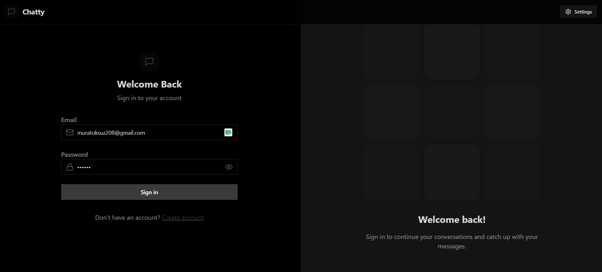
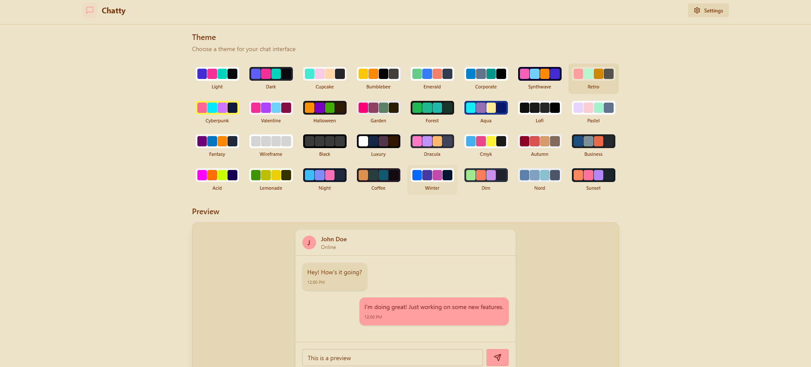
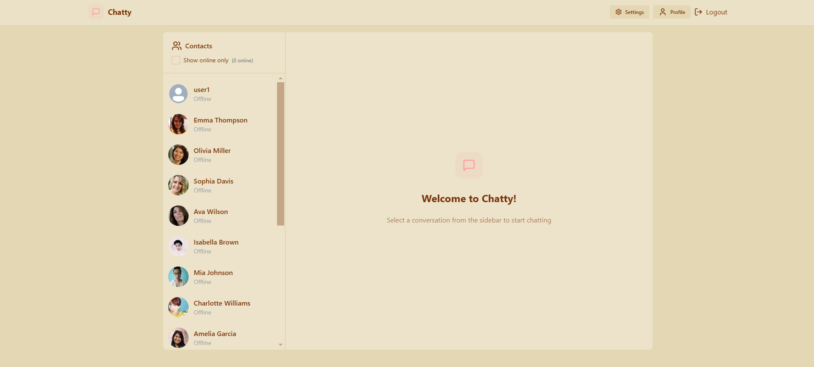
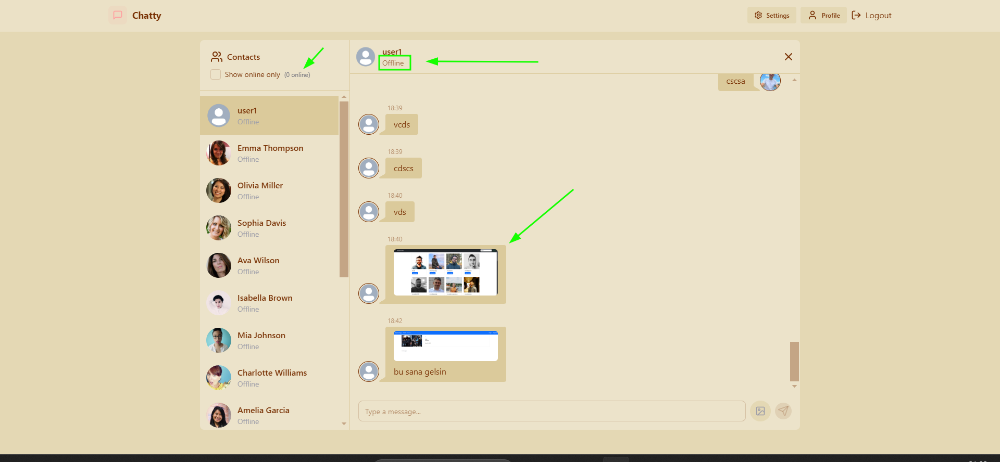
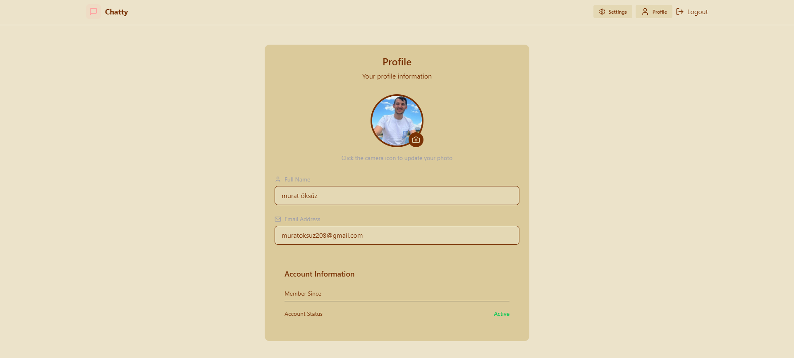

# Real-time Chat Application

In this project, I created a real-time chat application where users can check each other's online/offline status and send images. The project utilizes various technologies including **Axios**, **TailwindCSS**, **Zustand**, **Socket.io**, **Cloudinary**, and **MongoDB**.

## Features

- Real-time messaging using Socket.io
- User's online/offline status tracking
- Ability to send and receive images
- Customizable themes in the settings

## Screenshots

Below are the screenshots of the application, displayed in a 2x3 grid:

### Row 1

|  |  |  |
|:----------------------------------:|:-------------------------------------:|:---------------------------------:|
| Login page                           | Settings page, where you can change the theme. | Homepage displaying the user list and message input. |

### Row 2

|  |  |
|:-----------------------------------:|:------------------------------------:|
| Sample user with online/offline status indicator and ability to send pictures. | Profile page, this is me. |

---

## Getting Started

To get started with the project, follow these steps:

1. Clone the repository to your local machine.
2. Navigate to both the **frontend** and **backend** directories and run the following command to install the required dependencies:
    ```bash
    npm install
    ```
3. To run the application in development mode, use the following command:
    ```bash
    npm run dev
    ```
4. The application should now be running on your local server.

Enjoy building and using the application!

